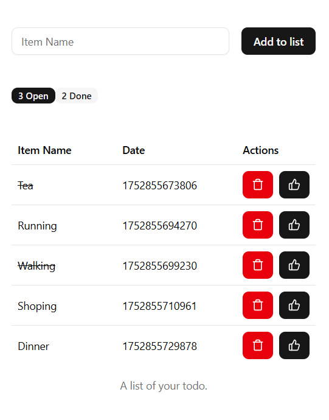

# 📝 React Todo List App



A simple and clean Todo List application built using React with:

- ✅ `useReducer` for state management  
- 💾 LocalStorage for data persistence  
- 🎯 Action-driven design (add, delete, mark done)  
- ⚛️ Functional components and type-safe code with TypeScript

---

## 🚀 Features

- 📥 **Add items** to your todo list
- ✅ **Mark items as done** with a single click
- 🗑️ **Delete tasks** permanently
- 💾 **Persist tasks using LocalStorage**
- 🧮 **Track Open/Done task counts**
- 🖼️ Simple, modern UI using icons and clean CSS

---

## 🧠 What You’ll Learn

This app demonstrates:

### 🔁 `useReducer`

How to manage complex state transitions in React using `useReducer`:
- Add new todo
- Delete todo
- Mark as done
- Initialize state from localStorage

### 💾 Local Storage Integration

- Store todos in `window.localStorage`
- Load saved todos on app start

### 🎯 Action-Driven Architecture

Using an `ActionType` object and strict action payload types for clear state handling.

### 🧱 TypeScript Usage

- Strongly typed state (`State`)
- Type-safe `Action` interface with discriminated unions
- Todo list item interface (`List`)

---

## 📁 Project Structure

```
.
├── src/
│   ├── components/
│   │   └── todo/
│   │       ├── TodoInput.tsx
│   │       ├── TodoList.tsx
│   │       └── TodoStatus.tsx
│   ├── types/
│   │   └── todo.ts
│   ├── App.tsx
│   ├── App.css
│   └── main.tsx
└── README.md
```

---

## 🔨 How It Works

### ✅ Add Item

```ts
dispatch({
  type: ActionType.ADD_ITEM,
  payload: "New Task"
});
```

### 🗑️ Remove Item

```ts
dispatch({
  type: ActionType.REMOVE_ITEM,
  payload: itemId
});
```

### ✅ Mark Item as Done

```ts
dispatch({
  type: ActionType.UPDATE_MARK_DONE,
  payload: itemId
});
```

### 🔁 Load from LocalStorage

```ts
useEffect(() => {
  const list = window.localStorage.getItem(LIST);
  if (list) {
    dispatch({
      type: ActionType.SET_LOCAL_DATA,
      payload: list,
    });
  }
}, []);
```

---

## 🧪 Sample UI


> 📸 Make sure this image file is in the project root or update the path to where your image is stored.

---

## 💡 Ideas for Improvement

- ✏️ Add edit functionality
- 🏷️ Add categories/tags
- 🔍 Filter Open vs Done tasks
- 🌙 Add dark mode toggle

---

## 📦 Getting Started

```bash
# Install dependencies
npm install

# Start the development server
npm run dev
```

Then open your browser at:  
👉 `http://localhost:5173/` (or what Vite shows)

---

## 👨‍💻 Author

Made with ❤️ by Swapnil

---
